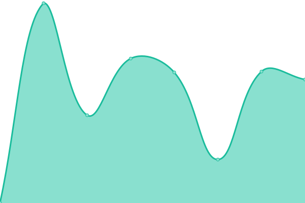

# [📈 Live Status](https://status.nexalinux.xyz): <!--live status--> **🟩 All systems operational**

This repository contains the open-source uptime monitor and status page for [Upptime](https://upptime.js.org), powered by [Upptime](https://github.com/upptime/upptime).

With [Upptime](https://upptime.js.org), you can get your own unlimited and free uptime monitor and status page, powered entirely by a GitHub repository. We use [Issues](https://github.com/upptime/upptime/issues) as incident reports, [Actions](https://github.com/NexaLinux/status.nexalinux.github.io/actions) as uptime monitors, and [Pages](https://status.nexalinux.xyz) for the status page.

<!--start: status pages-->
<!-- This summary is generated by Upptime (https://github.com/upptime/upptime) -->
<!-- Do not edit this manually, your changes will be overwritten -->
<!-- prettier-ignore -->
| URL | Status | History | Response Time | Uptime |
| --- | ------ | ------- | ------------- | ------ |
|  [Website](https://nexalinux.xyz) | 🟩 Up | [website.yml](https://github.com/NexaLinux/status.nexalinux.github.io/commits/HEAD/history/website.yml) | 

 754ms
     
 | 

<a href="https://status.nexalinux.xyz/history/website">100.00%</a>
    

|  [Documentation](https://docs.nexalinux.xyz) | 🟩 Up | [documentation.yml](https://github.com/NexaLinux/status.nexalinux.github.io/commits/HEAD/history/documentation.yml) | 

 243ms
     
 | 

<a href="https://status.nexalinux.xyz/history/documentation">100.00%</a>
    

|  [Packages](https://packages.nexalinux.xyz) | 🟩 Up | [packages.yml](https://github.com/NexaLinux/status.nexalinux.github.io/commits/HEAD/history/packages.yml) | 

 181ms
     
 | 

<a href="https://status.nexalinux.xyz/history/packages">100.00%</a>
    

|  [Scripts](https://scripts.nexalinux.xyz) | 🟩 Up | [scripts.yml](https://github.com/NexaLinux/status.nexalinux.github.io/commits/HEAD/history/scripts.yml) | 

 185ms
     
 | 

<a href="https://status.nexalinux.xyz/history/scripts">100.00%</a>
    

<!--end: status pages-->

[**Visit our status website →**](https://status.nexalinux.xyz)

## 📄 License

- Powered by: [Upptime](https://github.com/upptime/upptime)
- Code: [MIT](./LICENSE) © [Anand Chowdhary](https://anandchowdhary.com), supported by [Pabio](https://pabio.com)
- Data in the `./history` directory: [Open Database License](https://opendatacommons.org/licenses/odbl/1-0/)
